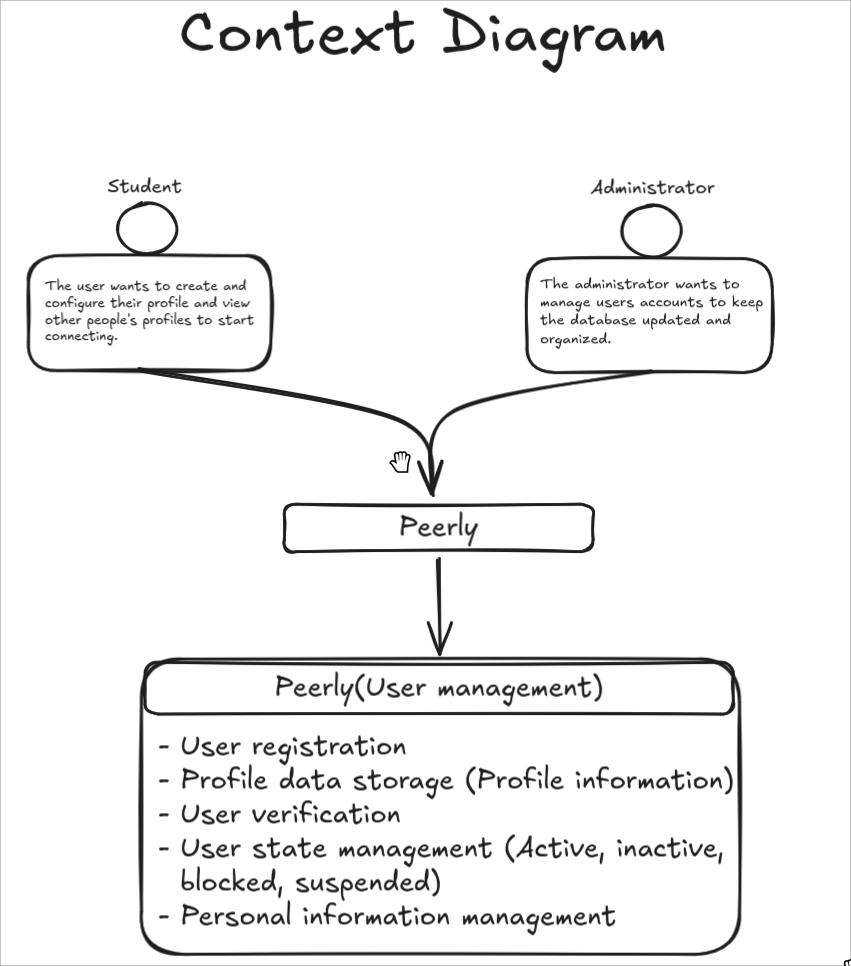
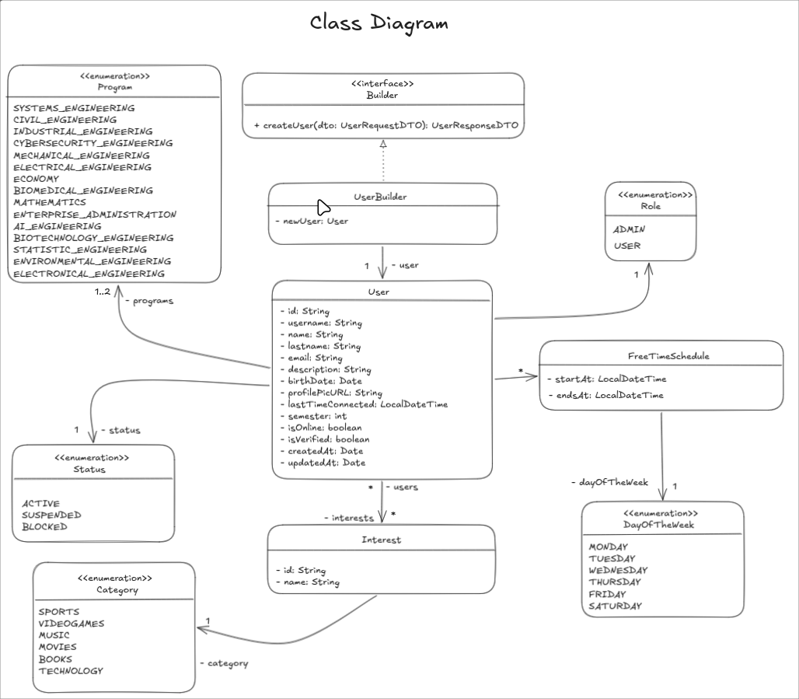
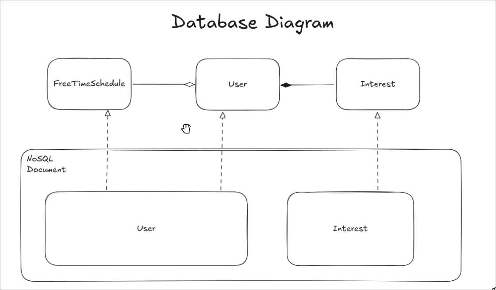

# Peerly User Management

Backend microservice for user management in the Peerly application. Provides CRUD operations for users, interests, and free time schedules.

## Description

This microservice handles all user-related functionality including:

- User account management (create, read, update, delete)
- User interests management
- Free time schedule management
- Role-based access control

## Developers

- Daniel Patiño Mejia
- Nestor David Lopez Castañeda
- Diego Fernando Chavarro Castillo
- David Santiago Palacios Pinzón

## Tech Stack

- **Framework**: NestJS
- **Database**: MongoDB with Mongoose
- **Language**: TypeScript

## Project Structure

```
src/
├── contexts/
│   └── user/
│       ├── domain/           # Core business logic
│       │   ├── entities/     # Domain entities
│       │   ├── enums/        # Domain enumerations
│       │   └── ports/        # Port interfaces
│       ├── application/      # Application services & use cases
│       │   ├── service/
│       │   └── use-cases/
│       └── infrastructure/   # External adapters
│           └── adapters/
│               ├── in/       # Input adapters (HTTP)
│               └── out/      # Output adapters (Persistence)
├── app.module.ts
└── main.ts
```

## Getting Started

### Prerequisites

- Node.js (LTS version)
- pnpm (recommended) or npm
- MongoDB instance

### Installation

```bash
# Clone the repository
$ git clone https://github.com/The-Johnnie-Walkers/peerly-user-management.git
$ cd peerly-user-management

# Install dependencies
$ pnpm install
```

### Configuration

Create a `.env` file in the root directory:

```env
# MongoDB connection
MONGODB_URI=mongodb://localhost:27017/peerly

# Application
PORT=3000
```

### Running the app

```bash
# development
$ pnpm run start

# watch mode
$ pnpm run start:dev

# production mode
$ pnpm run start:prod
```

## API Endpoints

### Users

| Method | Endpoint     | Description     |
| ------ | ------------ | --------------- |
| GET    | `/users`     | Get all users   |
| GET    | `/users/:id` | Get user by ID  |
| POST   | `/users`     | Create new user |
| PATCH  | `/users/:id` | Update user     |
| DELETE | `/users/:id` | Delete user     |

### Interests

| Method | Endpoint         | Description         |
| ------ | ---------------- | ------------------- |
| GET    | `/interests`     | Get all interests   |
| GET    | `/interests/:id` | Get interest by ID  |
| POST   | `/interests`     | Create new interest |
| PATCH  | `/interests/:id` | Update interest     |
| DELETE | `/interests/:id` | Delete interest     |


## Testing

```bash
# Run all tests
$ pnpm run test

# Run tests with coverage
$ pnpm run test:cov

# Run end-to-end tests
$ pnpm run test:e2e
```

## System Architecture & Design

### Context Diagram



### Class Diagram


### Database Diagram


